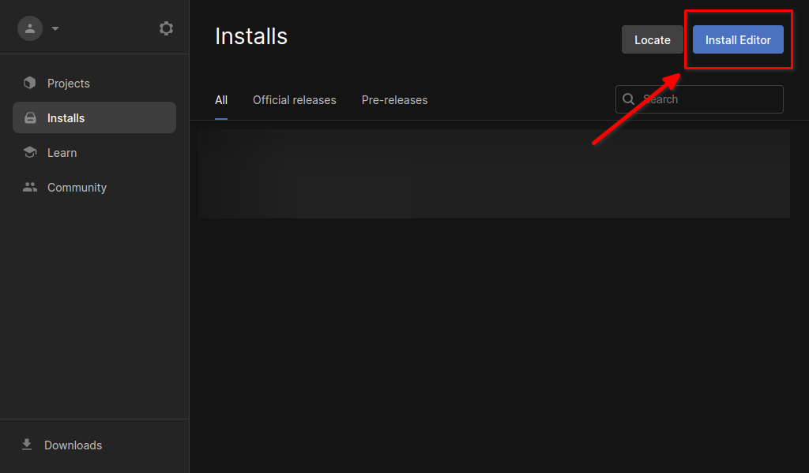

# Installing Unity

## Installing UnityHub
### Debian/Ubuntu
Follow this [webpage](https://docs.unity3d.com/hub/manual/InstallHub.html#install-hub-linux).

### RHEL/CentOS
Follow this [webpage](https://docs.unity3d.com/hub/manual/InstallHub.html#install-hub-linux).

### Fedora
Follow this [tutorial](https://www.reddit.com/r/Fedora/comments/wupxy7/how_to_install_correctly_unity_hub_on_fedora/).

### Arch Linux/Arch-based/Manjaro/EndeavourOS
Assuming you use `paru` as your AUR helper (like a useful human being)
```sh
paru -S unityhub
```


## Installing Unity itself
1. Create a Unity account from [this webpage](https://id.unity.com/account/new).
2. Launch Unity Hub.
3. Login with your Unity account.
4. Go to "Installs".


5. Press "Install Editor".



6. Select the latest 2020.3.xx LTS release.


## Common possible issues
I (the person writing this part of the document) have an issue where Unity can't start at all sometimes or will show empty errors in the project, to solve this, I had to run unityhub using this command right here
```sh
DOTNET_SYSTEM_GLOBALIZATION_INVARIANT=1 unityhub
```
